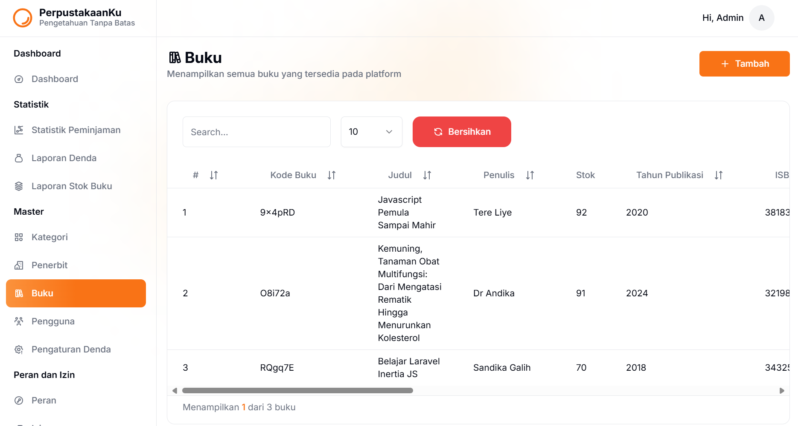
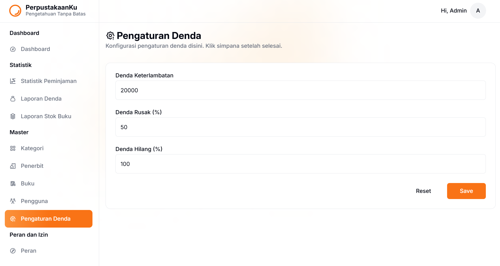
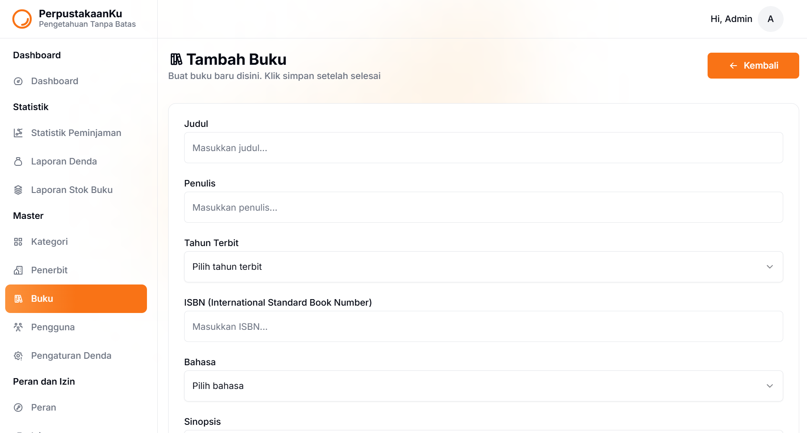
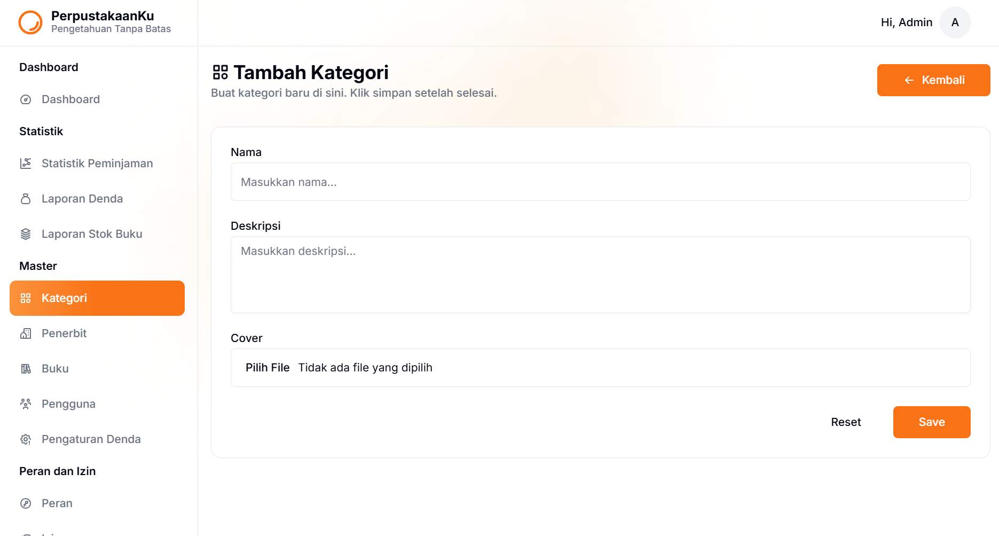
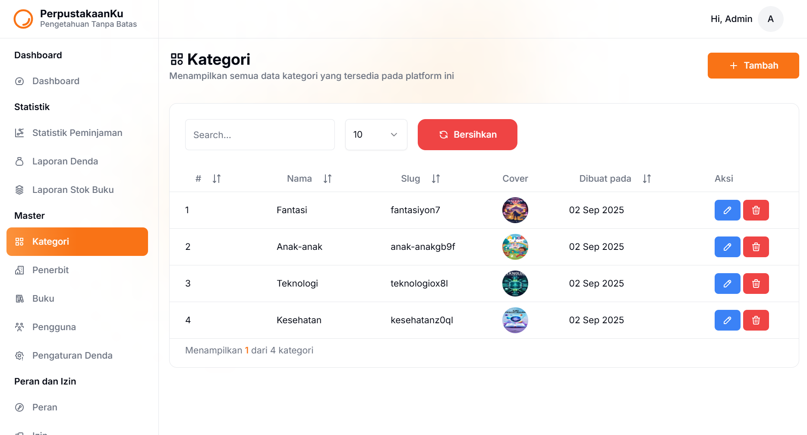
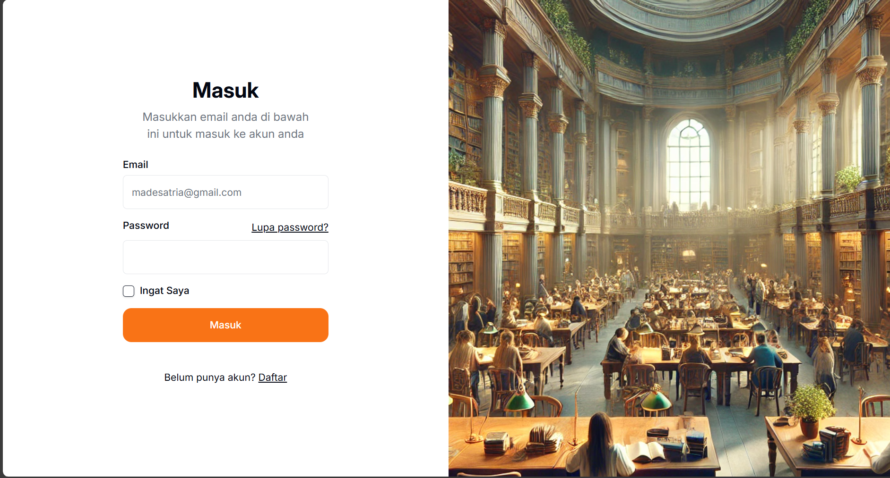
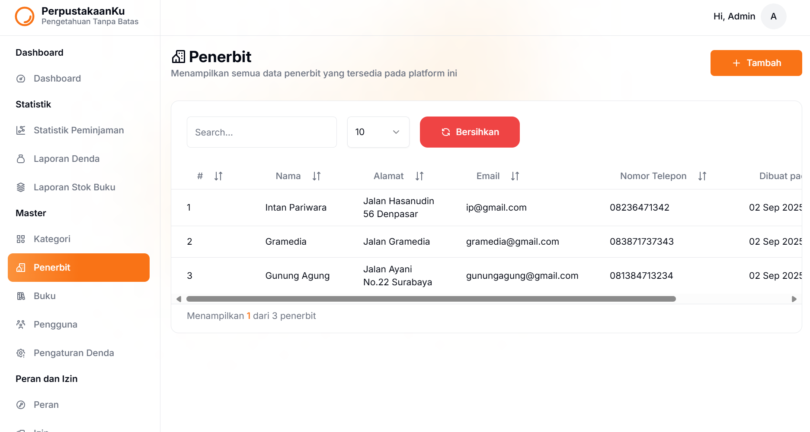
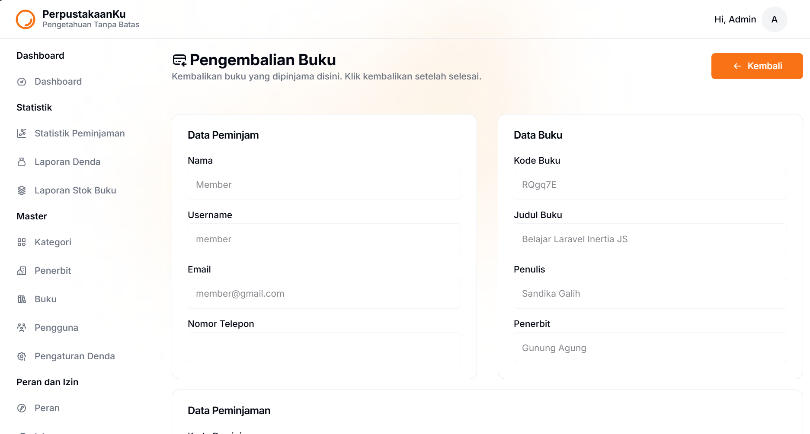
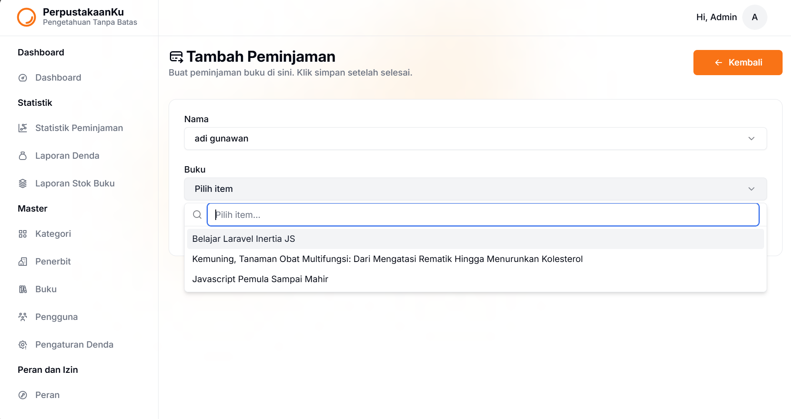

## Screenshot

Berikut beberapa tampilan aplikasi:

| Buku | Denda | Form Buku |
|------|-------|-----------|
|  |  |  |

| Form Kategori | Kategori | Login |
|---------------|----------|-------|
|  |  |  |

| Penerbit | Pengembalian | Form Peminjaman |
|----------|--------------|-----------------|
|  |  |  |


## Cara Instalasi

1. **Clone repository**
   ```sh
   git clone <url-repo-anda>
   cd <nama-folder-repo>
   ```

2. **Copy file environment**
   ```sh
   cp .env.example .env
   ```

3. **Install dependency PHP**
   ```sh
   composer install
   ```

4. **Install dependency JavaScript**
   ```sh
   npm install
   ```

5. **Generate application key**
   ```sh
   php artisan key:generate
   ```

6. **Konfigurasi database**
   - Edit file `.env` dan sesuaikan konfigurasi `DB_DATABASE`, `DB_USERNAME`, dan `DB_PASSWORD` sesuai database Anda.

7. **Jalankan migrasi dan seeder (opsional)**
   ```sh
   php artisan migrate --seed
   ```

8. **Build asset frontend**
   ```sh
   npm run build
   ```
   Atau untuk development:
   ```sh
   npm run dev
   ```

9. **Jalankan server lokal**
   ```sh
   php artisan serve
   ```

10. **Akses aplikasi**
    - Buka browser dan akses `http://localhost:8000`

---

**Catatan:**  
- Pastikan sudah menginstall PHP, Composer, Node.js, dan npm di komputer Anda.
- Untuk fitur tertentu, pastikan konfigurasi file `.env` sudah sesuai kebutuhan.
